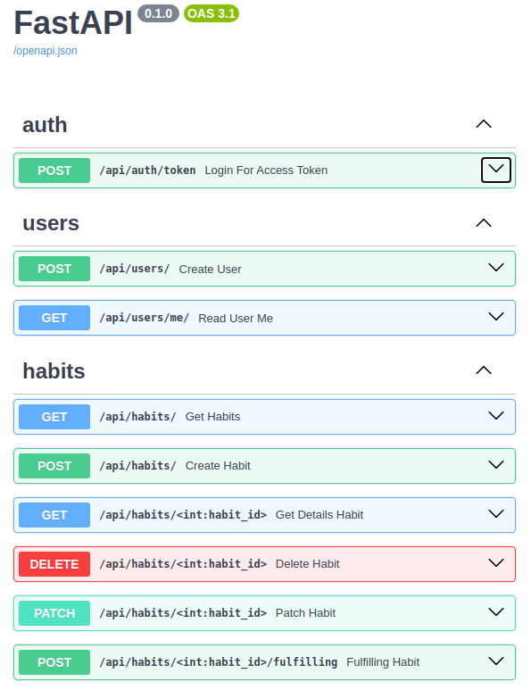
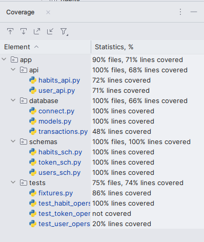

<div style="text-align: center;">

<h1 style="text-align: center">Backend для сервиса привития привычек.</h1>
</div>

###  Описание приложения.
Проект представляет собой сервис для привития полезных привычек.
Сервис позволяет пользователям ставить себе цели и задачи,
отслеживать прогресс и получать напоминания о необходимости выполнения действий.

Сервис состоит из нескольких модулей:

1. Модуль регистрации и авторизации пользователей.

2. Модуль создания целей и задач. Пользователь может создавать различные задачи, которые он хочет достичь. Например, задачи «читать каждый день по 30 минут», «смотреть фильмы на английском языке» и т.д.

3. Модуль отслеживания прогресса. Пользователь может видеть свой прогресс в достижении поставленных задач.

4. Модуль напоминаний. Сервис отправляет пользователю уведомления о необходимости выполнения задач.

Все данные пользователей хранятся на сервере в базе данных. Для обеспечения безопасности данных используются современные методы шифрования и защиты информации.

Серверная часть проекта написана на языке программирования Python с использованием фреймворка FastAPI

Бэкенд включает в себя следующие функции:

---
###  Запуск.
Запуск через Docker-compose:
Открываем терминал, переходим в корневую папку с проектом:

1. Создаём образ командой ```docker-compose -p app_fastapi_postgres build```
2. Поднимаем контейнер ```docker-compose -p app_fastapi_postgres up```

---

###  Swagger.


* auth - действия с токеном.
  * post /api/auth/token/ - получение jwt токена.
* users - действия с пользователем.
  * post /api/users/ - создание нового пользователя.
  * get /api/users/me - информация о пользователе.
* habits - действия с привычками текущего пользователя.
  * get /api/habits/ - возвращает все привычки.
  * post /api/users/ - создание новую привычку.
  * get /api/habits/<int> - возвращает детали привычки.
  * delete /api/habits/<int> - удаляет привычку.
  * patch /api/habits/<int> - обновляет данные о привычке.
  * post /api/habits/<int>./fulfilling - засчитывает выполнение привычки.

---

###  Тестирование.
Приложение покрыто на 71% unit-тестами и проверено линтерами (black, isort, flake8, mypy).
Тесты запускаются в терминале 
```
pytest app/tests/
```


---

<h2>Лицензия</h2>
Проект распространяется под лицензией MIT.